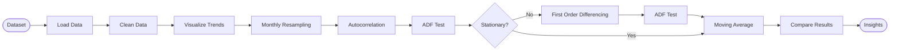
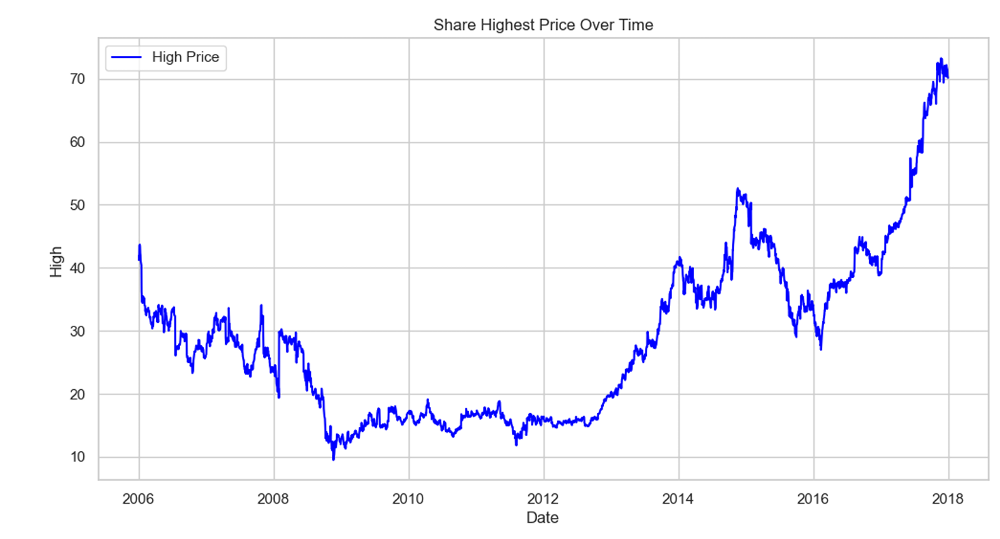
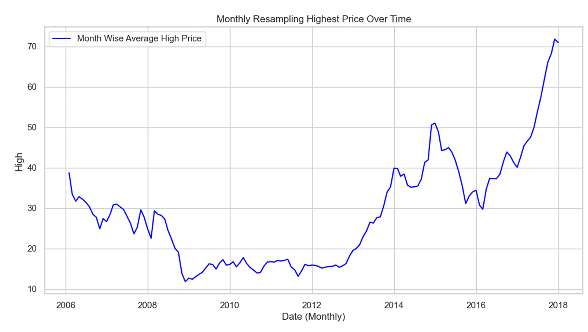
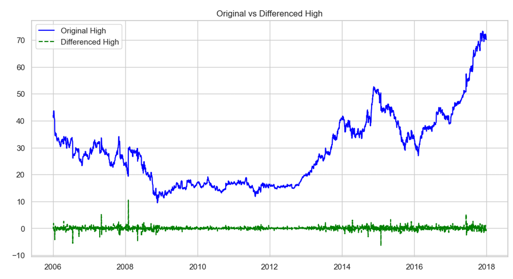
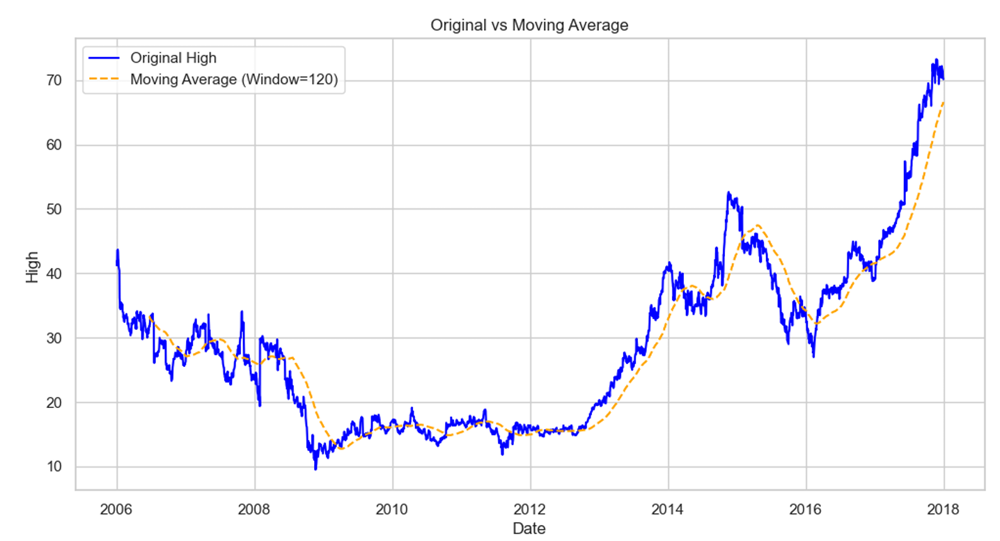

# 📈 Time Series Analysis & Visualization in Python

> A Time Series Analysis project that explores historical stock price data to identify trends, seasonality, stationarity, and temporal patterns using Python.


---

# 📌 Project Overview

Time series data consists of observations recorded over time, making it useful for identifying long-term trends, recurring seasonal patterns, and forecasting future values.

In this project, I performed **Time Series Analysis** on historical stock market data using Python. The project demonstrates essential time series concepts including trend analysis, resampling, autocorrelation, stationarity testing using the Augmented Dickey-Fuller (ADF) test, differencing, and moving averages through data visualization and statistical techniques.

---

# 🎯 Problem Statement

The objective of this project is to analyze historical stock price data and answer questions such as:

- 📈 How have stock prices changed over time?
- 📅 What long-term trends become visible after resampling?
- 🔄 Does the dataset exhibit seasonality?
- 📊 Is the time series stationary?
- ⚡ Can differencing transform the series into a stationary one?
- 📉 How does a moving average help smooth fluctuations?

---

# 💼 Analysis Objectives

| Analysis | Objective |
|-----------|-----------|
| 📈 Stock Price Trend | Visualize stock price movement over time |
| 📅 Monthly Resampling | Observe long-term trends by reducing noise |
| 🔄 Autocorrelation Analysis | Detect seasonality within the data |
| 📊 Stationarity Test | Determine whether statistical properties remain constant |
| ⚡ Differencing | Transform non-stationary data into stationary data |
| 📉 Moving Average | Smooth fluctuations and highlight long-term trends |

---

# 🎯 Expected Outcomes

This project aims to:

- Understand the fundamentals of Time Series Analysis.
- Detect trends and seasonal patterns.
- Evaluate stationarity using statistical tests.
- Apply differencing techniques.
- Smooth noisy data using moving averages.
- Build strong foundations for forecasting models.

---

# ✨ Project Highlights

- 📊 Complete Time Series Analysis workflow
- 🧹 Data preprocessing and cleaning
- 📈 Trend visualization
- 📅 Monthly resampling
- 🔄 Seasonality detection using Autocorrelation Function (ACF)
- 📊 Stationarity testing using the Augmented Dickey-Fuller Test
- ⚡ Differencing for stationarity
- 📉 Moving Average smoothing
- 📒 Implemented in Jupyter Notebook

---

# 🛠️ Tech Stack

- Python
- Pandas
- NumPy
- Matplotlib
- Seaborn
- Statsmodels
- Jupyter Notebook

---

# 📂 Project Structure

```text
Time-Series-Analysis/
│
├── data/
│   └── stock_data.csv
│
├── notebooks/
│   └── Time_Series_Analysis.ipynb
│
├── images/
│   ├── stock_trend.png
│   ├── monthly_resampling.png
│   ├── autocorrelation.png
│   ├── differencing.png
│   ├── moving_average.png
│   └── adf_results.png
│
├── requirements.txt
├── README.md
└── LICENSE
```

---

# 📊 Dataset Information

The dataset contains historical stock market data with the following attributes:

- Date
- Open Price
- High Price
- Low Price
- Close Price
- Trading Volume
- Stock Name

---

# 🔍 Analysis Workflow

## 1️⃣ Data Loading

- Imported stock market dataset
- Parsed Date column into DateTime format
- Set Date as the index

---

## 2️⃣ Data Cleaning

- Removed unnecessary columns
- Verified data types
- Prepared the dataset for time series analysis

---

## 3️⃣ Exploratory Time Series Analysis

The following analyses were performed:

- Historical stock price visualization
- Monthly resampling
- Trend analysis
- Autocorrelation (ACF)
- Stationarity testing (ADF Test)
- Differencing
- Moving Average smoothing

---
## 🔄 Project Pipeline



---

# 📈 Visualizations

The project includes visualizations such as:

- 📈 Time Series Line Plot
- 📅 Monthly Resampled Trend
- 🔄 Autocorrelation (ACF) Plot
- 📊 Original vs Differenced Series
- 📉 Moving Average Plot

---

# 💡 Key Insights

### 📈 Trend Analysis

- The stock price exhibits significant long-term fluctuations over time.

### 📅 Monthly Resampling

- Monthly aggregation reduces short-term noise and highlights broader market trends.

### 🔄 Autocorrelation

- The ACF plot indicates temporal dependence between observations, suggesting recurring patterns.

### 📊 Stationarity

- The original time series is **non-stationary**, as confirmed by the Augmented Dickey-Fuller (ADF) test.

### ⚡ Differencing

- First-order differencing transforms the series into a stationary one by removing trend components.

### 📉 Moving Average

- Applying a moving average smooths short-term volatility and provides a clearer visualization of long-term trends.

---

# 🚀 Getting Started

## Clone the Repository

```bash
git clone https://github.com/yourusername/Time-Series-Analysis.git
```

## Install Dependencies

```bash
pip install -r requirements.txt
```

## Launch Jupyter Notebook

```bash
jupyter notebook
```

Open:

```
notebooks/Time_Series_Analysis.ipynb
```

---

# 📸 Sample Outputs

Add screenshots of important visualizations inside the **images/** folder.

Example:











---

# 📚 Concepts Demonstrated

- Time Series Analysis
- Data Cleaning
- Trend Analysis
- Resampling
- Autocorrelation Function (ACF)
- Stationarity Testing
- Augmented Dickey-Fuller (ADF) Test
- Differencing
- Moving Average
- Data Visualization
- Python for Data Analytics

---

# 📖 Libraries Used

```python
pandas
numpy
matplotlib
seaborn
statsmodels
```

---

# 👩‍💻 Author

**Latika Manoj Ray**

Aspiring Data Analyst | Python | SQL | Power BI | Data Visualization | Machine Learning

---

⭐ If you found this project useful, consider giving the repository a **Star**!
